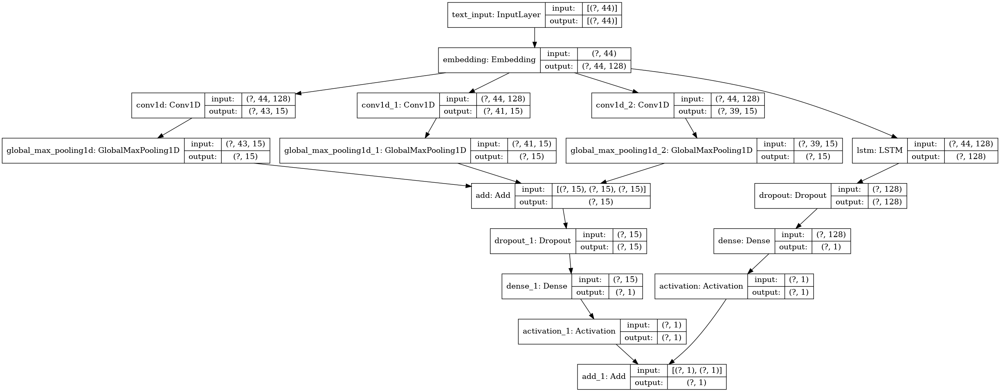

# DGA Detection
A simple yet accurate machine learning model to detect the DGA (Domain Generational Algorithm).

## Model

```
Model: "model"
__________________________________________________________________________________________________
Layer (type)                    Output Shape         Param #     Connected to                     
==================================================================================================
text_input (InputLayer)         [(None, 44)]         0                                            
__________________________________________________________________________________________________
embedding (Embedding)           (None, 44, 128)      4992        text_input[0][0]                 
__________________________________________________________________________________________________
conv1d (Conv1D)                 (None, 43, 15)       3855        embedding[0][0]                  
__________________________________________________________________________________________________
conv1d_1 (Conv1D)               (None, 41, 15)       7695        embedding[0][0]                  
__________________________________________________________________________________________________
conv1d_2 (Conv1D)               (None, 39, 15)       11535       embedding[0][0]                  
__________________________________________________________________________________________________
global_max_pooling1d (GlobalMax (None, 15)           0           conv1d[0][0]                     
__________________________________________________________________________________________________
global_max_pooling1d_1 (GlobalM (None, 15)           0           conv1d_1[0][0]                   
__________________________________________________________________________________________________
global_max_pooling1d_2 (GlobalM (None, 15)           0           conv1d_2[0][0]                   
__________________________________________________________________________________________________
lstm (LSTM)                     (None, 128)          131584      embedding[0][0]                  
__________________________________________________________________________________________________
add (Add)                       (None, 15)           0           global_max_pooling1d[0][0]       
                                                                 global_max_pooling1d_1[0][0]     
                                                                 global_max_pooling1d_2[0][0]     
__________________________________________________________________________________________________
dropout (Dropout)               (None, 128)          0           lstm[0][0]                       
__________________________________________________________________________________________________
dropout_1 (Dropout)             (None, 15)           0           add[0][0]                        
__________________________________________________________________________________________________
dense (Dense)                   (None, 1)            129         dropout[0][0]                    
__________________________________________________________________________________________________
dense_1 (Dense)                 (None, 1)            16          dropout_1[0][0]                  
__________________________________________________________________________________________________
activation (Activation)         (None, 1)            0           dense[0][0]                      
__________________________________________________________________________________________________
activation_1 (Activation)       (None, 1)            0           dense_1[0][0]                    
__________________________________________________________________________________________________
add_1 (Add)                     (None, 1)            0           activation[0][0]                 
                                                                 activation_1[0][0]               
==================================================================================================
Total params: 159,806
Trainable params: 159,806
Non-trainable params: 0
__________________________________________________________________________________________________

```

The model is combining three CNN with different kernels and an LSTM.

## Dataset
The DGA dataset used in the repo comes from [360 Netlab](https://data.netlab.360.com/dga/), please refer to their site to get the newest dataset.  
The benign domain is defined as: appeared in [Tranco](https://tranco-list.eu/) top 1M for more than 30 days in the past 2 months, and not in known DGA dataset. Note that while many researchers use Alexa, I believe that [Tranco](https://tranco-list.eu/methodology) is much more robust.

## Result
Though simple, it's surprisingly accurate.  

When the dataset is large (2197049 unique domain, trian : val : test = 0.72 : 0.08 : 0.20) reaching the accuracy of 99.38% in 13 epoch.  

```
              precision    recall  f1-score   support

           0       0.99      1.00      0.99    198414
           1       1.00      0.99      0.99    240996

    accuracy                           0.99    439410
   macro avg       0.99      0.99      0.99    439410
weighted avg       0.99      0.99      0.99    439410
```

When the dataset is relatively small (20000 unique domain, trian:val:test = 0.72 : 0.08 : 0.20) reaching the accuracy of 98.19% in 55 epoch.

```
              precision    recall  f1-score   support

           0       0.98      0.98      0.98      1973
           1       0.98      0.98      0.98      2027

    accuracy                           0.98      4000
   macro avg       0.98      0.98      0.98      4000
weighted avg       0.98      0.98      0.98      4000
```

While far from state-of-the-art models, the model is still better than I expected.

## Reference
This project is heavily inspired by:
1. [keeganhines/snowman](https://github.com/keeganhines/snowman/)
2. [endgameinc/dga_predict](https://github.com/endgameinc/dga_predict/)

And the dataset is from:
1. [360 Netlab](https://data.netlab.360.com/dga/)
2. [Tranco](https://tranco-list.eu/)